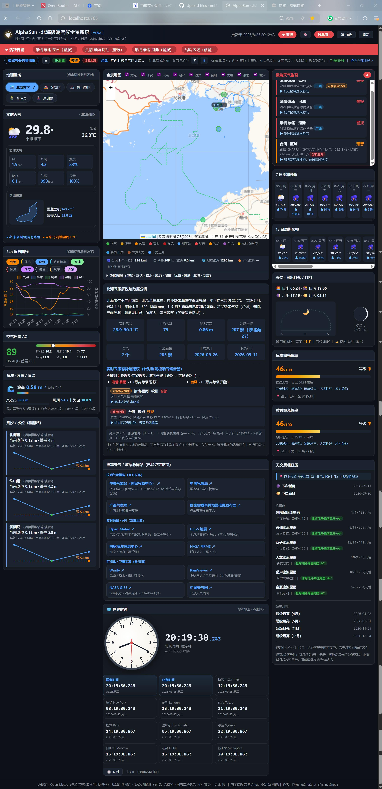

# AlphaSun · 北海极端气候全景系统

**版本 v8.2.0 ｜ 作者：阳光 net2net2net（ Vx: net2net ）｜ 许可：MIT**

一套以**北海为中心**的极端气候全景监测仪表盘：聚合互联网权威多个气候数据源，实现实时天气、周期预报、多灾种极端告警、全景地图、世界时钟与可叠加卫星 / 雷达图层。纯 Node.js、零第三方依赖、内置便携运行时，**开箱即运行**。

## 适用设备及方式
智能体（技能）、Windows（exe 单文件）、Linux / macOS、安卓 Android（APK）、iOS（ipa 测试版）。各端均内置**自动更新检查**：启动后比对 GitHub 最新版本，发现新版本按当前平台给出下载或重载指引（页脚「检查更新」可手动触发）。

下载 / 安装（稳定最新版，由 CI 自动发布到 GitHub Release）：

- **Windows exe**：https://github.com/net2net2net/alphasun-beihai-climate/releases/latest/download/alphasun-beihai-climate.exe
- **Linux**：https://github.com/net2net2net/alphasun-beihai-climate/releases/latest/download/alphasun-beihai-climate-linux
- **macOS**：https://github.com/net2net2net/alphasun-beihai-climate/releases/latest/download/alphasun-beihai-climate-macos
- **安卓 Android APK**：https://github.com/net2net2net/alphasun-beihai-climate/releases/latest/download/alphasun-beihai-climate.apk
- **iOS ipa（测试版）**：[未签名 IPA（GitHub Release，需自签）](https://github.com/net2net2net/alphasun-beihai-climate/releases/latest/download/alphasun-beihai-climate-ios.ipa) — 用 Sideloadly + 免费 Apple ID 自签装 iPad/iPhone（证书 7 天有效，到期重签）；详见下方「移动端 APP」。
- **全部平台 / 源码**：https://github.com/net2net2net/alphasun-beihai-climate/releases

## 建设目标
构建覆盖北海全域（海城 / 银海 / 铁山港 / 合浦 / 涠洲岛）的极端气候全景系统，实现：
1. **全方位权威实时天气**：陆地气象 + 空气质量（AQI/六项污染物）+ 海洋（潮汐/水位/海浪/风暴潮）+ 卫星（云图/红外）+ 天文（日出日落/月出月落/月相/晚霞概率/天文景观）。
2. **周期预报**：7 日 + 15 日趋势 + 24 小时逐时曲线。
3. **极端天气告警**：地震、汛情、干旱、高温、台风、野火等多灾种分级告警与处置建议。
4. **地图全景**：以地图为底座，按风险等级着色，叠加卫星云图、火点、台风路径。
5. **世界时钟**：机械钟 + 数字钟（毫秒精度）+ 多时区 + 对时，支撑跨时区应急协同。

## 快速开始
- **单文件 exe（推荐，最简单）**：从 [Windows exe（稳定最新版）](https://github.com/net2net2net/alphasun-beihai-climate/releases/latest/download/alphasun-beihai-climate.exe) 下载 → 双击运行 → 浏览器自动打开 http://localhost:8765。无需安装 Node.js、零外部文件（Linux / macOS 版本见上方链接）。
- **独立运行（完整目录）**：双击 `app/start.bat`（Windows）或 `bash app/start.sh`（Linux / macOS）→ 打开 http://localhost:8765
- **由智能体运行**：见 `INSTALL.md`；技能加载后执行 `node app/server.js`

## 包内容
- **单文件 exe（CI 自动发布）**：Windows / Linux / macOS 三平台单文件可执行程序（内置 Node 运行时 + 全部前端资源），见「下载 / 安装」段落（GitHub Release）。
- `app/`：完整可运行系统源码（server.js + lib + public + 内置 node），用于二次开发或 `node app/server.js` 直接运行。
- `app-android/`：移动端 APP 版（Capacitor 纯前端封装，一套 `www/` 同时生成 **iOS + Android**，直连数据源，可在手机独立运行；APK 可由 GitHub Actions 云端自动构建）
- `SKILL.md`：技能定义（触发 + 运行流程）
- `INSTALL.md`：跨智能体 / 独立安装说明
- `CHANGELOG.md`：版本变更总览
- `knowledge-base/`：完整文档（设计 / 使用 / API / 分发）

## 文档导航

| 类别 | 文档 | 说明 |
|------|------|------|
| **设计** | [knowledge-base/设计文档.md](knowledge-base/设计文档.md) | 总体架构、数据域与权威源矩阵、告警引擎、地图方案、世界时钟、实施状态 |
| **实施 / 构建** | [docs/EXE使用说明.md](docs/EXE使用说明.md) | 单文件 exe（Node SEA）构建与校验方法 |
| | [app-android/README.md](app-android/README.md) | 移动端（iOS + Android）Capacitor 工程、云端构建与安装 |
| | [app-android/docs/iOS-Sideload-Guide.md](app-android/docs/iOS-Sideload-Guide.md) | 未签名 IPA 用 Sideloadly + 免费 Apple ID 自签装机指南 |
| | [.github/workflows/](.github/workflows/) | CI 自动构建（exe / apk / ipa）工作流 |
| **安装** | [INSTALL.md](INSTALL.md) | 跨智能体 / 独立安装说明 |
| | [knowledge-base/技能安装与分发指南.md](knowledge-base/技能安装与分发指南.md) | 作为独立软件 / 技能安装、跨智能体分发 |
| **说明 / 使用** | [knowledge-base/使用手册.md](knowledge-base/使用手册.md) | 运行方式、界面导览、环境变量、常见问题 |
| | [knowledge-base/API接口文档.md](knowledge-base/API接口文档.md) | 全部 HTTP 接口定义与字段说明 |
| **变更** | [CHANGELOG.md](CHANGELOG.md) | 版本变更总览 |
| **技能** | [SKILL.md](SKILL.md) | 技能定义（触发 + 运行流程） |

## 核心功能
- **实时天气**：大温标 + 体感 + 风/阵风/湿度/降水/气压/云量指标卡片；地理区域选择后展示「区域概况」（覆盖面积、覆盖人口、真实行政区轮廓）。
- **周期预报**：7 日 + 15 日趋势、24h 逐时曲线（可增删维度）。
- **多灾种告警**：5 级规则引擎（正常/注意/预警/警报/紧急），地震/汛情/台风/野火/风暴潮等，标注「涉及北海 / 可能涉及北海」与「距北海」距离。
- **全景地图**：真实北海边界 + 风险着色 + 台风/地震/火点/预警图层 + 卫星云图/雷达叠加。
- **模块点击放大**：点任意面板标题 → 页面中央放大该板块与数据。
- **警报指示 + 声音报警**：有告警红色闪烁「⚠ 警报」，无告警绿色「✅ 无警报」；🔇 按钮开启声音报警（默认关）。
- **深 / 浅色主题**：顶栏一键切换，默认深色，localStorage 记忆。
- **世界时钟**：机械钟（毫秒扫秒）+ 数字钟（毫秒）+ 设备/北京/国际时区 + 对时功能。
- **情报播报**：顶部告警情报自动滚动播报，可暂停 / 翻页 / 查看详情。

## 数据来源
- 陆地 / 海洋 / 空气质量 / 洪涝：**Open-Meteo** 全系（免费、免密钥）
- 地震：**USGS** GeoJSON
- 台风与气象预警：**中央气象台（nmc）**
- 中国气象局实况校核（多源交叉验证）：**和风天气 QWeather**（CMA 官方商业分发方；配置 KEY 后作为 `cma` 源参与「多源气候数据校核」，提供温度/湿度/风/气压/紫外线等）
- 天文与晚霞概率：**服务端本地计算**（免额外数据源）
- 卫星云图 / 雷达：经中央气象台代理叠加（绕开防盗链 / CORS）

### 配置和风天气 KEY（可选，启用 CMA 实况校核源）
和风天气需 KEY。本系统**不硬编码密钥**，按以下任一方式提供即可（环境变量优先级高于本地文件）：

```bash
# 方式一：本地配置文件（推荐，已被 .gitignore 忽略，绝不入库）
cp app/config.example.json app/config.json
# 编辑 app/config.json，填入你的 KEY 与 Host
#   { "qweatherKey": "你的KEY", "qweatherHost": "devapi.qweather.com" }
#   - 免费版/开发版订阅用 devapi.qweather.com；标准版/商业版订阅用 api.qweather.com

# 方式二：环境变量
export QWEATHER_KEY="你的KEY"
export QWEATHER_HOST="devapi.qweather.com"   # 或 api.qweather.com
node app/server.js
```
> 若调用和风返回 `403 Invalid Host`，说明该 KEY 的订阅计划未授权所填 Host（或 KEY 未激活/已过期），请到和风天气控制台核对订阅类型与授权 Host；修复后无需改代码即自动生效。未配置 KEY 时，CMA 实况校核源标记为「未配置·可选」，系统照常运行（回落公开接口兜底）。

## 重建单文件 exe（可选）
exe 因体积（约 84–120MB 各平台）未纳入 git，需要时可自行构建（采用 **Node.js 单文件应用 SEA** 方案，无需 `pkg`）：
```bash
cd app
npm install esbuild postject   # 构建期依赖（仅打包用，运行时零依赖）
npm run build:assets           # 将 public/ 内联为 embedded-assets.js
npm run build:exe              # 输出 app/dist/alphasun-beihai-climate.exe（及 -linux / -macos）
```
> 说明：`app/dist/`（构建产物）被 `.gitignore` 排除，故 git 仓库为**源码 + 文档**形态；本地运行也可直接 `node app/server.js`（无需 exe）。`build-exe.js` 使用官方 Node 二进制注入（`postject`），规避 `pkg` 上游基础二进制下线的风险。

## 单文件 exe 下载（CI 自动发布）

为方便直接使用，三平台**单文件 exe** 由 GitHub Actions 在推送 `main` 后自动构建并发布到 **GitHub Release**（始终为最新版，无需找特定 tag）：

- **Windows**：[alphasun-beihai-climate.exe](https://github.com/net2net2net/alphasun-beihai-climate/releases/latest/download/alphasun-beihai-climate.exe)
- **Linux**：[alphasun-beihai-climate-linux](https://github.com/net2net2net/alphasun-beihai-climate/releases/latest/download/alphasun-beihai-climate-linux)
- **macOS**：[alphasun-beihai-climate-macos](https://github.com/net2net2net/alphasun-beihai-climate/releases/latest/download/alphasun-beihai-climate-macos)
- **大小**：约 83–87 MB（内置 Node 运行时 + 全部前端资源）
- **使用说明 / 校验方法**：[docs/EXE使用说明.md](docs/EXE使用说明.md)
- **系统运行效果图**：



> 运行：双击 exe → 浏览器自动打开 http://localhost:8765（Linux / macOS 赋予可执行权限后 `./alphasun-beihai-climate-linux`）。需联网获取实时数据；如被杀软误报，加入白名单即可。详细见使用说明文档。

## 移动端 APP（iOS + Android）

把系统打包为可在手机独立运行的 APP（Capacitor 纯前端封装，一套 `www/` 同时生成 iOS 与 Android）：

- **项目目录**：[`app-android/`](app-android/)（含完整 `www/` 前端 + Capacitor 配置 + 双端构建文档 [README](app-android/README.md)）
- **数据源**：由 `www/js/data.js` 直连 Open-Meteo / USGS / 中央气象台，无需 Node 后端
- **降级项**：中央气象台卫星/雷达产品图在手机端无法跨域抓取，地图叠加层提示「点 ↗ 看官方原图」；野火 / 潮汐缺省降级（可在 `www/index.html` 填 key 增强）
- **获取安卓 APK（无需本机装 Android Studio）**：APK 由 CI 在推送 `main` 后自动构建并发布到 **GitHub Release**（资产名 `alphasun-beihai-climate.apk`，始终最新：[点此下载](https://github.com/net2net2net/alphasun-beihai-climate/releases/latest/download/alphasun-beihai-climate.apk)）。也可从 [Actions](https://github.com/net2net2net/alphasun-beihai-climate/actions) → **Build Android APK** 运行下载 Artifact `alphasun-beihai-apk` → 解压 `app-debug.apk` 安装。未自动触发时手动 **Run workflow**。
- **本机构建（安卓）**：装 Android Studio + Node 18+ 后，`cd app-android && npm install && npx cap add android && npx cap build android` 生成 APK（详见 [app-android/README.md](app-android/README.md)）。
- **iOS（无需 Mac，推荐）**：仓库内置 `build-ios.yml` 工作流在 GitHub 云端构建并**发布到 GitHub Release**（永久留存，资产名 `alphasun-beihai-climate-ios.ipa`）。拿到后（[最新版](https://github.com/net2net2net/alphasun-beihai-climate/releases/latest/download/alphasun-beihai-climate-ios.ipa) 或 Actions → **Build iOS** → Run workflow 下载 Artifact `alphasun-ios-unsigned-ipa`）用 **Sideloadly + 免费 Apple ID** 自签装 iPad/iPhone（详见 [app-android/docs/iOS-Sideload-Guide.md](app-android/docs/iOS-Sideload-Guide.md)）。若仓库配置了 `APPLE_CERT_P12` 等 Secrets，则产出已签名 IPA（可 AltStore/企业/App Store 分发）。
- **本机构建（iOS，需 Mac + Xcode）**：`cd app-android && npm install && npx cap add ios && npx cap open ios`，Xcode 中 Run / Archive（详见 [app-android/README.md](app-android/README.md)）。

## 自动更新（多端）
系统内置版本检查，覆盖所有分发形态：

- **智能体（技能）**：git 拉取最新仓库（`git pull` 或重新安装技能）即更新。
- **Windows / Linux / macOS（exe）**：页脚检测到新版本 → 点击「下载 X 版」获取最新 exe → 覆盖原文件即可；也可由服务端 `/api/latest` 比对。
- **安卓 Android（APK）**：页脚提示 → 下载最新 APK → 安装覆盖（版本号自增，无需卸载）。
- **iOS（ipa）**：Sideloadly + 免费 Apple ID 自签安装（证书 7 天有效，到期前重签续期）；配置 Apple 开发者密钥后为已签名版（AltStore / 企业 / App Store 分发）。
- **网页 / PWA**：服务端资源更新后刷新页面即生效；自托管用户拉取最新代码后重启服务。

检测机制：前端周期性（每 30 分钟）请求服务端 `/api/latest`（服务端代理 GitHub raw 的 `version.json`），与当前版本号比较；页脚「检查更新」可手动触发。无外网时静默跳过。

## 说明
- 部分中央气象台产品页为 JS 动态渲染，叠加失败时保留官方原图链接（不伪造坏图）。
- 生产化建议：注册天地图 / 高德 Key（GCJ-02 合规底图）、密钥服务端托管、对接权威海洋 / 台风 / 干旱源、等保加固。
